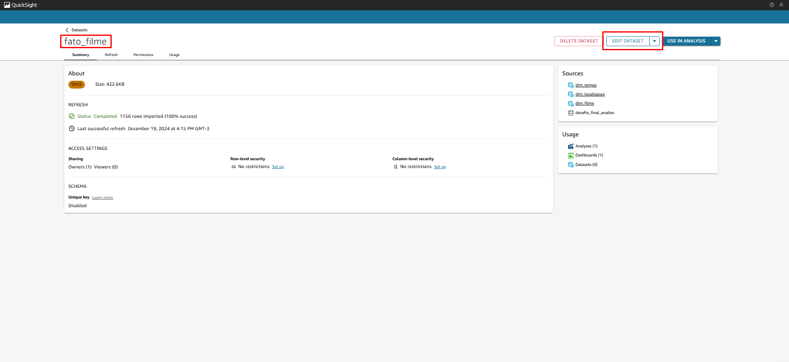
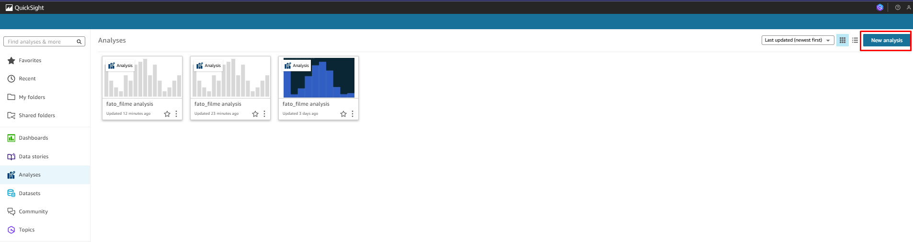
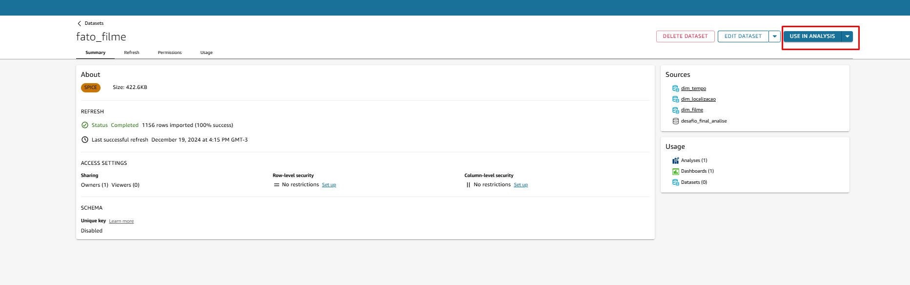
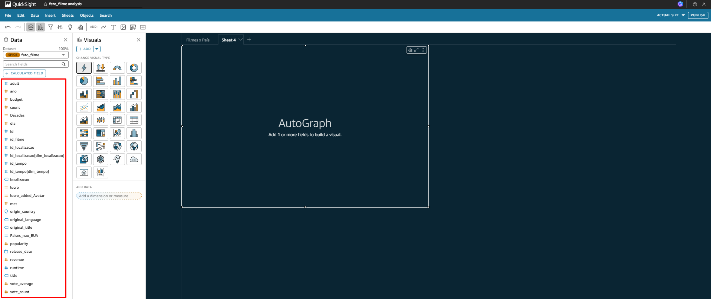
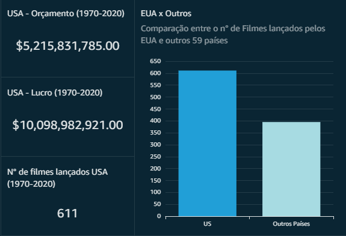
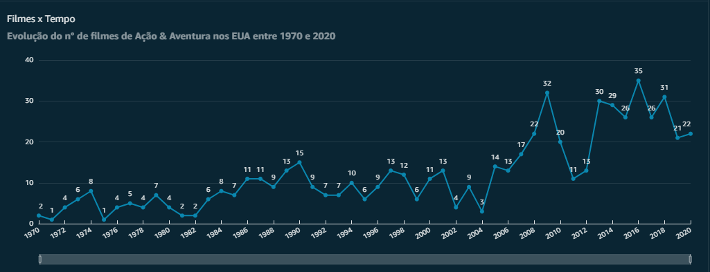
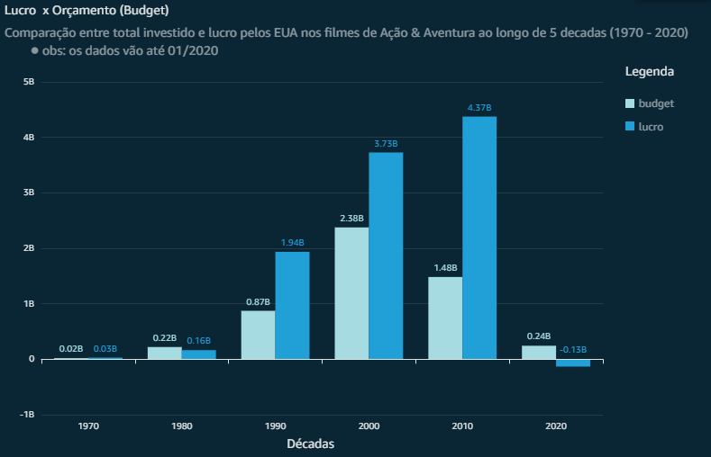
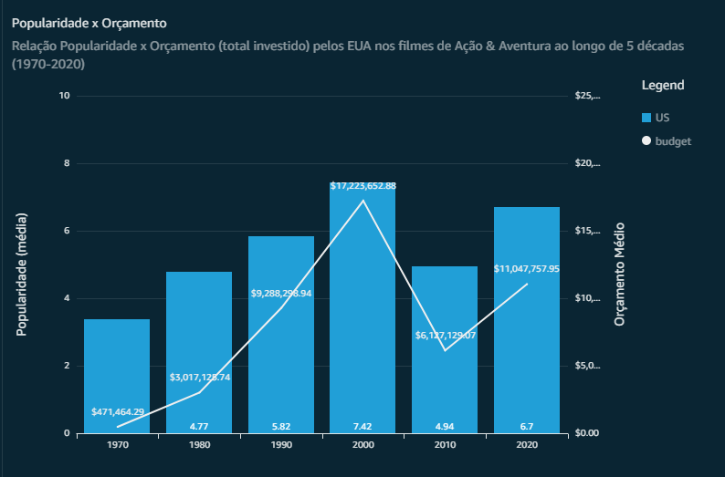
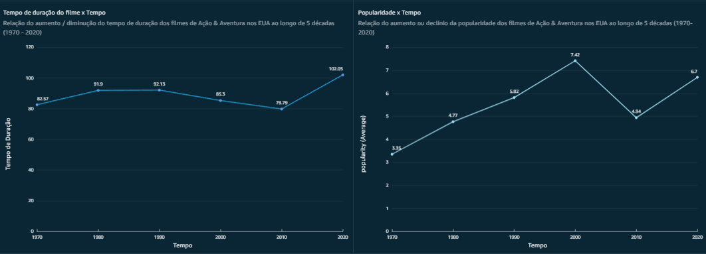
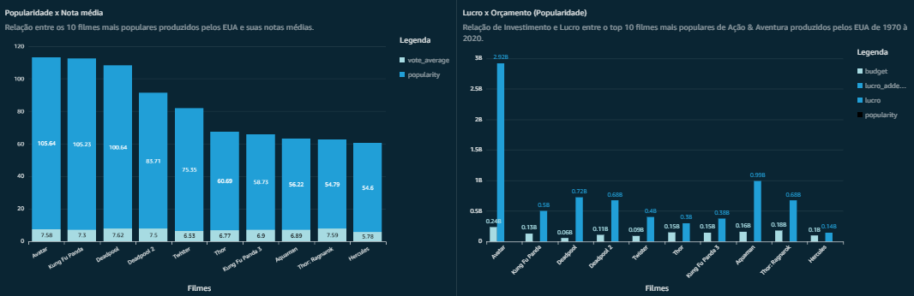

### Passo 1:

O primeiro no serviço AWS QuickSight foi criar criar os datasets. Segue abaixo as evidências:

Após clicar em new dataset, deve-se selecionar a opção ``"Athena"``:

Em seguida, dar um nome ao Data Source e clicar em ``Create data source``:

Logo após, deve-se selecionar o database (Job-Trusted):

Após isso, deve-se selecionar as tables, uma a uma (ou seja, todas as dimensões):

E por fim, todos os datasets estão criados.

### Passo 2:

O passo 2 é realizar os joins. Para isso, clica-se primeiro na tabela principal (fato_filme) e após isso em "Edit Dataset"

Depois disso, fiz os lefts joins à todas as outras tabelas adjacentes;

### Passo 3

No passo 3 foi criada a análise, clicando no botão "New Analysis"

Em seguida, deve-se selecionar a fato:

E depois clicar em "Use in Analisys":

E por fim, esta é a tela onde os graficos foram criados:

## Gráficos e Historytelling:

Era dos Heróis: A Jornada dos Filmes de Ação e Aventura (1970-2020)

Nas décadas de 1970 a 2020, a indústria cinematográfica dos EUA viu uma transformação incrível nos gêneros de ação e aventura. Este período foi marcado pelo nascimento de ícones, evolução de técnicas cinematográficas e a conquista dos corações de espectadores em todo o mundo. 

--- 

### Gráfico 1: Numero de filmes lançados pelos US vs Outros países

A seguir, a pesquisa foi sobre o país dos EUA, tendo a hipotese inicial de que seria uma país destaque por se tratar de uma superpotência, além de ser o país que domina a lingua mundial.

- Nota-se que o EUA domina a produção de filmes de Ação e Aventura, produzindo apenas ele mais filmes que todos os filmes dos outros países analisados em questão somados.

### Gráfico 2: Lançamento de Filmes de Ação e Aventura nos EUA

O gráfico mostra a evolução do número de filmes de Ação e Aventura entre 1970 e 2020 nos US. No eixo horizontal (x) estão os anos, e no eixo vertical (y) está a quantidade de filmes lançados por ano.

Segue abaixo alguns insigts que podem ser retirados do gráfico:

- Quanta a tendencia Geral de Crescimento: Há uma tendência geral de crescimento no número de filmes de Ação e Aventura ao longo dos anos. Nos anos 70, o número de filmes era baixo, com alguns picos e vales, mas a partir dos anos 80, há um aumento mais consistente. Existem alguns picos notáveis no número de filmes lançados. Por exemplo, em 1990, houve um pico de 15 filmes, e em 2016, o número chegou a 35 filmes, o maior valor registrado no gráfico.

- Quedas Significativas e Recuperações: Após alguns picos, há quedas significativas. Por exemplo, após o pico de 2009, o número de filmes caiu para 20 em 2010 e 11 em 201, numero que se recuperou após 2 anos para 30 anos.

- Estabilidade nos Anos 90: Durante os anos 90, o número de filmes de Ação e Aventura se manteve relativamente estável, variando entre 7 e 13 filmes por ano.

### Gráfico 3: Lucro vs Orçamento dos filmes lançados pelos US

---

- Após notar a grande significância dos EUA na industria cinematográfica global nos filmes de Ação e Aventura, foi feita a pergunta: Quão grande foi a evolução do lucro em relação ao orçamento nos EUA ao longo de 5 décadas?

- Conclusões: Nota-se que existe uma tendência geral de crescimento tanto no investimento quanto no lucro dos filmes de Ação e Aventura ao longo dos anos. Nos anos 70, os investimentos e lucros eram relativamente baixos, mas a partir dos anos 90, há um aumento mais consistente. Além disso, a partir dos anos 90, notamos uma explosão de rentabilidade. O lucro saltou significativamente em comparação com as décadas anteriores. Por exemplo, o lucro nos anos 90 foi de 1.94 bilhões, muito acima do orçamento de 0.87 bilhões.

- De 2010 a 2020, apesar de na decada anterior ter tido um investimento maior, a decada seguinte lucrou ainda mais, com menos investimento, o que prova o crescimento da industria dos filmes de Ação e Aventura.

- A enorme diminuição de lucro e orçamento na década de 2020 se da porque os dados vão até 01/2020.

### Gráfico 4: Relação da popularidade vs Orçamento nos filmes de Ação e Aventura lançados pelos EUA

Após a analise do lucro vs orçamento, foi decidido fazer uma analise em relação a popularidade dos filmes de Ação & Aventura e a quantidade investida no filme. A hipótese base para a Análise foi: Será mesmo que o orçamento é diretamente proporcional a popularidade? ou seja, quanto mais se investe no filme, mais popular ele é?

- A hipotese acima foi confirmada através da analise da media da popularidade dos filmes e orçamento agrupada por decadas em 5 decadas consecutivas. Nota se que quando há um orçamento menor, a média da popularidade também cai, tomando como exemplo a decada de 2010.

### Gráficos 5 e 6: Comparação entre a relação da evolução da duraçao dos filmes ao longo das decadas e popularidade.

Nos graficos abaixo a intenção foi ainda investigar a relação da popularidade com outros fatores (em filmes de Ação & Aventura nos US), no caso em questão, a duração dos filmes. Para isso foi feita uma análise da evolução da duração dos filmes ao longo das decadas, e em paralelo, a evolução da popularidade dos filmes ao longo dos decadas.

Conclusões:
- Através da Analise dos dados, infere-se que não necessariamente há uma correlação, mas é evidente que alguns picos e vales dos graficos merecem atenção. 
- Observa-se que nas decadas de 80 e 90 a média de duração dos filmes não variou consideravelmente, porém, a popularidade cresceu, mesmo com uma pequena mudança nesse fator. De 1990 a 2000, a média de duração caiu, enquanto a popularidade aumentou.
- Na proxima decada a duração dos filmes caiu ainda mais, e de 2000 a 2010 a popularidade caiu imensamente, porém, um fator que influenciou nisso foi o investimento nos filmes, que nesse periodo também diminuiu.
- E por fim, nota-se que entre 2010 e 2020 a duração dos filmes aumentou, enquanto e a popularidade também. Porém, de 2010 a 2020 o orçamento tambem cresceu consideravelmente, ou seja o orçamento influencia muito mais na popularidade do que a duração do filme em si.

### Gráficos 7 e 8: Comparação entre a nota média e popularidade dos 10 filmes mais populares dos US, com seus respectivos orçamentos e lucros.

Abaixo, continuamos nossa analise do fator popularidade. A intenção dos graficos abaixo foi comparar a popularidade dos 10 filmes mais populares desde a decada de 70 até 2020 lançados pelos EUA, com seus lucros e orçamentos. 

Através da análise dos graficos, conclui-se que:

- Não necessariamente a nota de avaliação do filme tem relação com sua popularidade, pois por exemplo o filme "Kung Fu Panda" embora tenha a nota de avaliação menor que o filme "Deadpool", ainda sim tem sua popularidade maior. Analisando os dois mesmos filmes no grafico "Lucro x Orçamento", nota-se que foi investido mais no filme Kung Fu Panda que no filme Deadpool, apesar de o ultimo ter tido maior lucrabilidade. Ou seja, o como foi sugerido antes, o orçamento é o fator que mais influencia na popularidade dos filmes.
- Nota-se tambem que o filme Aquaman, apesar de encontrar-se na oitava posição entre os filmes mais populares dos EUA, é o segundo filme que mais teve lucro, estando em primeiro lugar com a maior bilheteria e popularidade da historia, o filme Avatar - tendo sido seu lucro de 2,92 bi.

--- 

Link para o Dashboard: 
