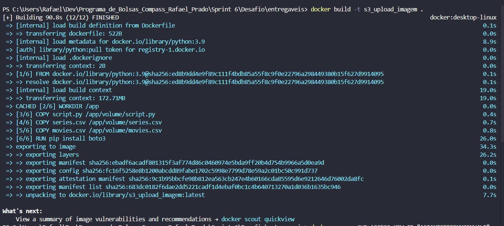
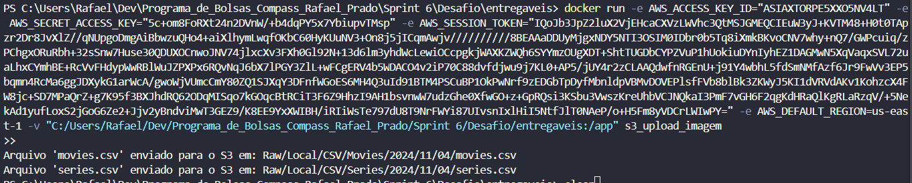
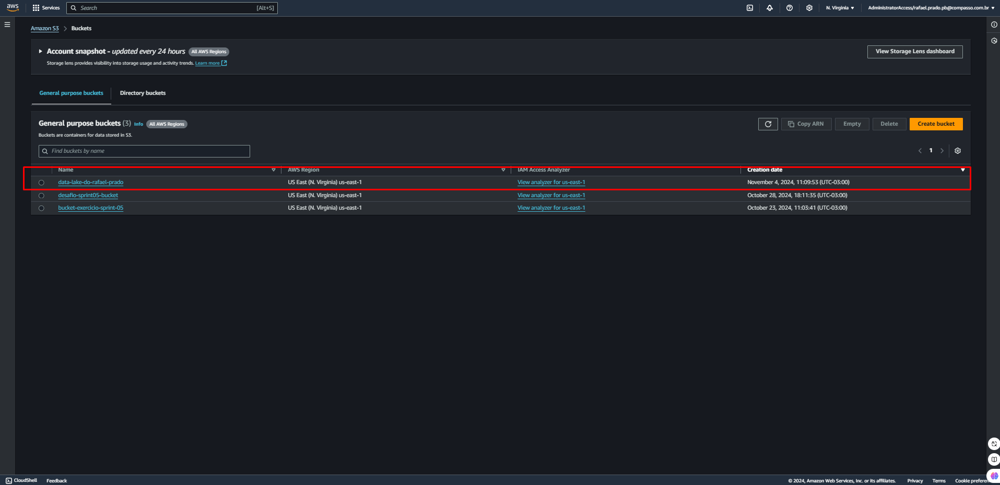
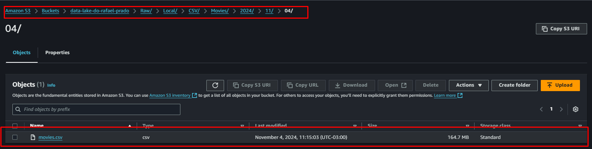
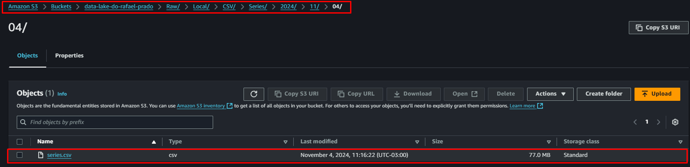

## ETAPA 1:

O proposito deste código é configurar um contêiner com Python 3.9 para rodar um script (script.py) que faz o upload dos arquivos series.csv e movies.csv para o S3 da AWS. Ele também instala a biblioteca boto3, que permite a conexão com o S3. Dessa forma, o contêiner cria um ambiente ideal para realizar uploads de dados na nuvem de forma fácil e automatizada.

- Segue abaixo o codigo do dockerfile usado para construção da imagem e em seguida sua explicação:

```Dockerfile 
FROM python:3.9

WORKDIR /app

VOLUME ["/app/volume"]

COPY script.py /app/volume/script.py
COPY series.csv /app/volume/series.csv 
COPY movies.csv /app/volume/movies.csv

RUN pip install boto3

CMD ["python", "/app/volume/script.py"]

```

1. **Imagem base**:
   - A imagem do contêiner é definida como `"python:3.9"`, garantindo que o ambiente de execução use Python 3.9.
2. **Configuração do ambiente de trabalho**:
   - O diretório de trabalho é configurado com `"WORKDIR /app"`, onde os arquivos e comandos subsequentes serão executados.
3. **Criação do volume**:
   - O comando `"VOLUME [\"/app/volume\"]"` cria um volume no contêiner.
4. **Copiando arquivos para o volume**:
   - Os arquivos `script.py`, `series.csv` e `movies.csv` são copiados para o diretório `/app/volume` usando os comandos `"COPY script.py /app/volume/script.py"`, `"COPY series.csv /app/volume/series.csv"` e `"COPY movies.csv /app/volume/movies.csv"`, tornando-os disponíveis para o script durante a execução.
5. **Instalação de dependências**:
   - O comando `"RUN pip install boto3"` instala a biblioteca boto3, necessária para interação com o S3 da AWS.
6. **Comando para execução do script**:
   - O comando `"CMD [\"python\", \"/app/volume/script.py\"]"` define que o script Python será executado quando o contêiner iniciar.

---

### Confirmação da devida criação da imagem no terminal:




## ETAPA 2:

Esse código tem como objetivo conectar-se ao S3 da AWS e enviar os arquivos movies.csv e series.csv para um bucket específico (data-lake-do-rafael-prado). Além disso, ele organiza o caminho de armazenamento no S3 com uma estrutura padrão que inclui camada, origem, formato, uma especificação para cada tipo de arquivo (filmes e séries) e a data de processamento. A função `enviar_para_s3` faz o upload dos arquivos seguindo essa estrutura, exibindo uma mensagem de confirmação ao final de cada envio.

- Segue abaixo o codigo do dockerfile usado para construção da imagem e em seguida sua explicação:

```Python
import boto3
from datetime import datetime

arquivo_filmes = '/app/movies.csv'
arquivo_series = '/app/series.csv'
bucket = 'data-lake-do-rafael-prado'
camada = 'Raw'
origem = 'Local'
formato = 'CSV'
especificacao_filmes = 'Movies'
especificacao_series = 'Series'
data_processamento = datetime.now().strftime('%Y/%m/%d')

s3 = boto3.client('s3')

def enviar_para_s3(arquivo_local, especificacao, arquivo_nome):
    caminho_s3 = f"{camada}/{origem}/{formato}/{especificacao}/{data_processamento}/{arquivo_nome}"
    s3.upload_file(arquivo_local, bucket, caminho_s3)
    print(f"Arquivo '{arquivo_nome}' enviado para o S3 em: {caminho_s3}")


enviar_para_s3(arquivo_filmes, especificacao_filmes, 'movies.csv')
enviar_para_s3(arquivo_series, especificacao_series, 'series.csv')

```


1. **Conexão com o S3**:
   - Primeiramente, a biblioteca `boto3` é importada para interação com a AWS, especificamente com o S3.
2. **Configuração dos arquivos e parâmetros**:
   - As variáveis `arquivo_filmes` e `arquivo_series` definem o caminho dos arquivos locais a serem enviados ao S3.
   - Variáveis como `bucket`, `camada`, `origem`, `formato`, `especificacao_filmes`, `especificacao_series` e `data_processamento` configuram os detalhes de armazenamento, incluindo a estrutura de pastas e data de processamento.
3. **Função de upload**:
   - A função `enviar_para_s3` recebe o caminho do arquivo local, especificação e nome do arquivo para enviar para o S3.
   - `caminho_s3` constrói o caminho de destino no S3 com a estrutura e data especificadas.
   - O comando `"s3.upload_file"` faz o upload do arquivo para o bucket no S3 no caminho configurado.
4. **Confirmação**:
   - A função exibe uma mensagem confirmando que o arquivo foi enviado para o caminho especificado no S3, indicando o sucesso da operação.
 
 ---
### Evidência da execução do código que sobe os CSV'S:


## Evidência da criação do bucket:


### Evidencia do Upload do CSV Movies:


### Evidencia do Upload do CSV Series:



## TIPO DE ANÁLISE A SER FEITA NO CSV:

- O tema do Squad em que me encontro é Ação/Aventura. A analise a ser feita por mim será baseada na `relação da duração dos filmes dos anos 80` (tempoMinutos) com a `nota de avaliação dos filmes`.

#
