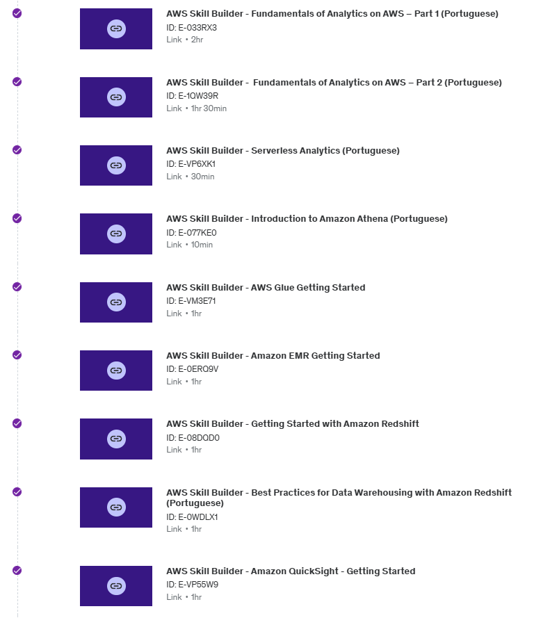

## RESUMO

Nesta Sprint, tivemos um aprendizado focado em AWS, foram feitos diversos cursos Skill Builders da AWS sobre serviços como Glue, EMR, Redshift, Athena, QuickSight, etc. No Desafio da sprint tivemos que subir arquivos para um bucket dentro da AWS através da ferramenta Docker, fazendo o uso de containers. Gostei bastante dessa sprint, pois acho o uso de docker além de muito útil também interessante.

## Evidências

Nesta sprint será dado destaque a evidência da criação da imagem do container, do script usado para subir os arquivos e do bucket criado na AWS.

---

### Imagem:

### Script:

### Bucket:

## Exercícios:

- Segue abaixo as evidências do código para realização da query do exercicio Lab AWS Athena e resultado e a evidência do resultado do exercício Lab AWS Lambda:

#### Lab AWS Athena:

#### Lab AWS Lambda:

## Certificados

- Segue os cursos feitos durante a sprint abaixo:

#### Segue abaixo o link dos respectivos certificados.

- [Certificados da Sprint 6](https://github.com/rafaprado013/Programa_de_Bolsas_Compass_Rafael_Prado/tree/main/Sprint%206/certificados)

