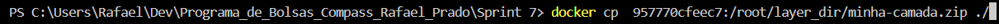
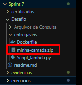
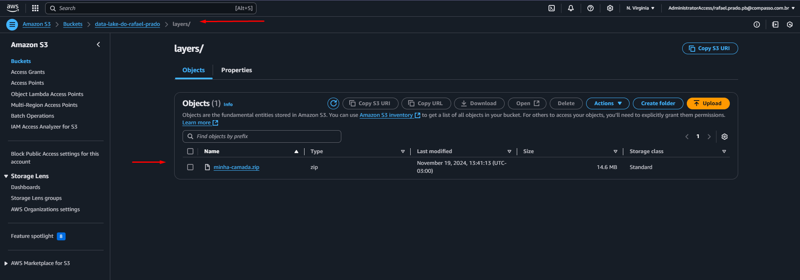
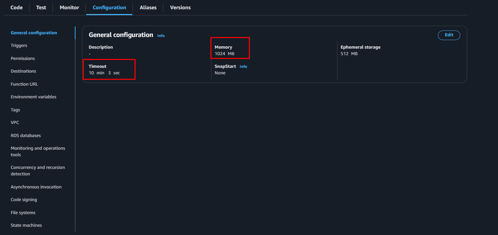
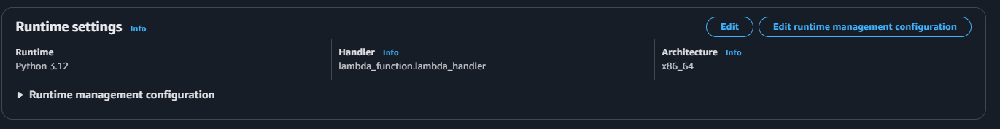

## ETAPA 1.1:

O propósito deste código é configurar o contêiner utilizando o Amazon Linux 2023 como base, preparando o ambiente para rodar scripts Python que possam interagir com o S3. Ele inclui a instalação do Python 3 e do pip que servem para executar scripts em Python e gerenciar dependências, como a biblioteca boto3. Além disso, a ferramenta zip é instalada, possibilitando também a compactação de arquivos.

- Segue abaixo o codigo do dockerfile usado para construção da imagem e em seguida sua explicação:

```Dockerfile 
FROM amazonlinux:2023
RUN yum update -y
RUN yum install -y \
    python3-pip \
    zip
RUN yum -y clean all
```

1. **Imagem Base**: 
- A imagem do contêiner é definida como `amazonlinux:2023`, garantindo que o ambiente de execução utilize o Amazon Linux 2023;

2. **Atualização do sistema**:
- O comando `RUN yum update -y` atualiza os pacotes do sistema para as versões mais recentes;

3. **Instalação de ferramentas necessárias**:
- O comando `RUN yum install -y \ python3-pip \ zip` instala o gerenciador de pacotes do Python (pip) e a ferramenta de compactação (zip). O pip é essencial para instalar bibliotecas como boto3, enquanto o zip permite a manipulação e compactação de arquivos.

4. **Limpeza do ambiente**:
- O comando `RUN yum -y clean all` remove os arquivos temporários gerados durante a instalação, reduzindo o tamanho final da imagem e tornando o contêiner mais eficiente.
---

### Confirmação da devida criação da imagem no terminal:


## ETAPA 1.2: 

Nesta etapa foi feita a criação da layer. Para isso, foi necessario **seguir o tutorial da criação de layers do exercício LAB LAMBDA da SPRINT 6**, o passo-a-passo é basicamente o mesmo, e por conta disso decidi não tirar prints do processo de criação, pois o tutorial é fornecido pelo PB e encontra-se no PDF do exercício da sprint 6 na Udemy. A diferença está no momento em que fazemos a `instalação de bibliotecas`, pois na ultima sprint foi feita a instalação da biblioteca `Pandas`, e nesta sprint, foi feita a instalação das bibliotecas `requests` e `boto3` na layer através do comando  `pip install` no terminal no momento da criação, com o `bash`. 

### Segue abaixo a evidência da criação da layer em zip:






--- 

### E após isso foi feito o Upload da layer no S3:



## ETAPA 2:


O propósito deste código abaixo é coletar informações de filmes da API do The Movie Database (TMDb) através do `Lambda` da AWS e salvar esses dados em um bucket S3 no formato JSON. Ele utiliza as bibliotecas requests e boto3 para, respectivamente, consumir a API e interagir com o serviço S3.

- Segue abaixo o codigo Lambda usado para a consulta ao TMDb e sua devida explicação resumida através dos comentários no código:

```Python
import requests
import json
import boto3
from datetime import datetime

# Chave da API do The Movie Database (TMDb), usada para autenticar as requisições.
api_key = "6a0efdab02802a37b023045239e9c652"

# URL base para buscar listas de filmes.
base_discover_url = "https://api.themoviedb.org/3/discover/movie"

# URL base para buscar detalhes específicos de um filme.
base_detail_url = "https://api.themoviedb.org/3/movie"

# Define o idioma das respostas como português do Brasil.
language = "pt-BR"

# Nome do bucket S3 onde os arquivos JSON serão salvos.
s3_bucket = "data-lake-do-rafael-prado"

# Caminho dentro do bucket para organizar os arquivos salvos.
s3_folder = "Raw/TMDB/JSON"

# Inicializa o cliente boto3 para interagir com o S3.
s3 = boto3.client("s3")

# Função para buscar filmes básicos na API do TMDb, de acordo com os filtros aplicados.
def buscar_filmes_basicos(api_key, pagina):
    # Constrói a URL com filtros: gênero, data de lançamento, nota mínima, e paginação.
    url = f"{base_discover_url}?api_key={api_key}&language={language}&page={pagina}&primary_release_date.gte=1970-01-01&primary_release_date.lte=2020-12-31&vote_average.gte=8&with_genres=28,12"
    resposta = requests.get(url)  # Faz a requisição à API.
    if resposta.status_code == 200:  # Verifica se a requisição foi bem-sucedida.
        return resposta.json().get("results", [])  # Retorna a lista de filmes básicos.
    else:
        print(f"Erro ao buscar filmes básicos: {resposta.status_code}")  # Log de erro.
        return []

# Função para buscar os detalhes de um filme específico pelo ID.
def buscar_detalhes_filme(api_key, movie_id):
    # Constrói a URL com o ID do filme.
    url = f"{base_detail_url}/{movie_id}?api_key={api_key}&language={language}"
    resposta = requests.get(url)  # Faz a requisição à API.
    if resposta.status_code == 200:  # Verifica se a requisição foi bem-sucedida.
        return resposta.json()  # Retorna os detalhes do filme.
    else:
        print(f"Erro ao buscar detalhes do filme {movie_id}: {resposta.status_code}")  # Log de erro.
        return None

# Função principal que será executada, ideal para uso em uma função AWS Lambda.
def lambda_handler(event, context):
    total_filmes = 3000  # Quantidade total de filmes a coletar.
    filmes_por_arquivo = 100  # Quantidade de filmes por arquivo JSON.
    pagina_atual = 1  # Página inicial para buscar filmes na API.
    filmes_coletados = []  # Lista para armazenar todos os filmes coletados.

    # Define a data atual para organizar os arquivos no S3 por ano/mês/dia.
    data_atual = datetime.now()
    ano = data_atual.strftime("%Y")
    mes = data_atual.strftime("%m")
    dia = data_atual.strftime("%d")

    # Loop para buscar filmes enquanto o limite não for atingido.
    while len(filmes_coletados) < total_filmes and pagina_atual <= 150:
        # Busca filmes básicos na página atual.
        filmes_basicos = buscar_filmes_basicos(api_key, pagina_atual)
        if not filmes_basicos:  # Para o loop se não houver mais filmes.
            break
        for filme in filmes_basicos:  # Itera sobre os filmes básicos retornados.
            # Busca os detalhes de cada filme pelo ID.
            detalhes = buscar_detalhes_filme(api_key, filme["id"])
            if detalhes:
                filmes_coletados.append(detalhes)  # Adiciona os detalhes à lista final.
        pagina_atual += 1  # Passa para a próxima página.

    # Limita a lista ao total máximo de filmes permitido.
    filmes_coletados = filmes_coletados[:total_filmes]

    # Divide os filmes em partes e salva cada uma como um arquivo JSON no S3.
    for i in range(0, len(filmes_coletados), filmes_por_arquivo):
        parte = i // filmes_por_arquivo + 1  # Define o número da parte atual.
        nome_arquivo = f"filmes-acao-aventura-1970-2020-part-{parte}.json"  # Nome do arquivo.
        caminho_s3 = f"{s3_folder}/{ano}/{mes}/{dia}/{nome_arquivo}"  # Caminho no S3.

        # Serializa os dados como JSON e os salva no bucket S3.
        json_data = json.dumps(filmes_coletados[i:i + filmes_por_arquivo], ensure_ascii=False, indent=4)
        s3.put_object(
            Bucket=s3_bucket,
            Key=caminho_s3,
            Body=json_data,
            ContentType="application/json"
        )

    # Retorna uma mensagem de sucesso com o número total de filmes coletados e salvos.
    return {
        "statusCode": 200,
        "body": f"{len(filmes_coletados)} filmes salvos em arquivos de no máximo 100 registros no bucket S3 '{s3_bucket}' na pasta '{s3_folder}/{ano}/{mes}/{dia}'."
    }

```

 ## ETAPA 3:

 - Nesta etapa foi feita a `criação e configuração da função Lambda`, a `adição da layer` e por fim a `execução do código acima no proprio lambda` - segue abaixo as evidências.

### Criação da função lambda:
 


### Configuração da função lambda:





### Adição da layer:


 

### Execução do código:


 ## ETAPA 4:

- O proximo passo foi conferir no S3 se tudo foi salvo corretamente como esperado.


- Com isso se da o final do desafio da Sprint 7.

### SOBRE AS ANÁLISES:

- Foi necessario nessa sprint fazer alterações nas analises que seriam feitas para que não se repetissem com as outras analises dos colegas da SQUAD. A análise atual é:

  - Relação entre `filmes com notas médias altas` (notaMedia) e `(numeroVotos)`/ comparação com filmes medianos. Exemplo: Filmes mais bem avaliados tem mais ou menos votos que filmes mal avaliados? 
  - `relação do numero de filmes de Ação` em que o protagonista é do `genero mascuino/feminino`, com o intuito de comparar a discrepância entre o numero de atrizes / atores em filmes de Ação;
  - `Evolução do faturamento dos filmes 'Ação/Aventura' ao longo das 5 ultimas decadas décadas.`

- Por fim, os filmes puxados nos json's seguem 3 critérios:
  - Filmes do gênero Ação e Aventura;
  - De 1970 a 2020;
  - nota > 8.