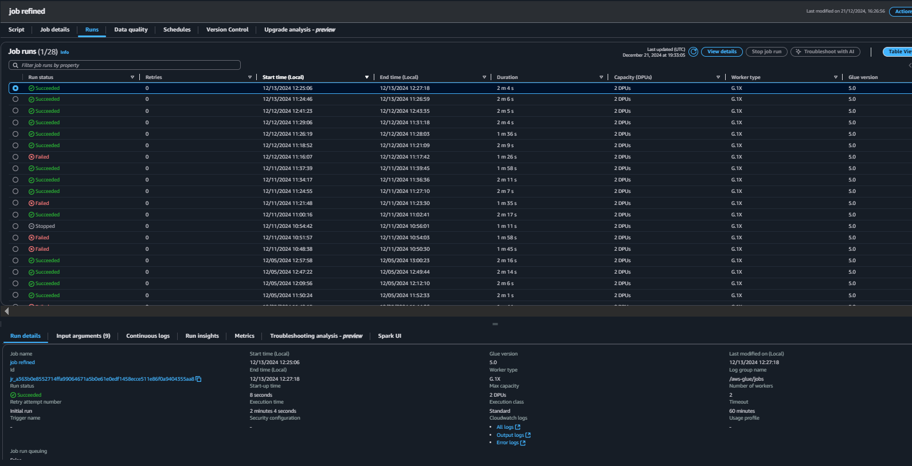
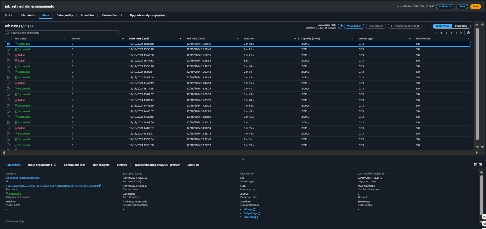
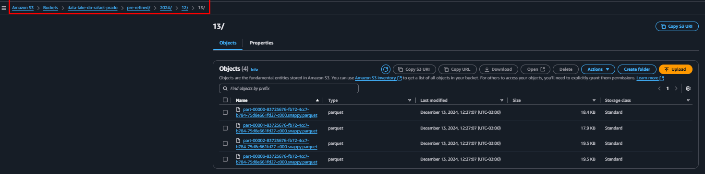
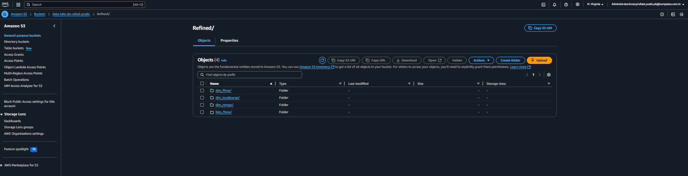
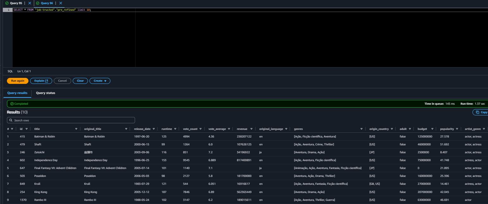
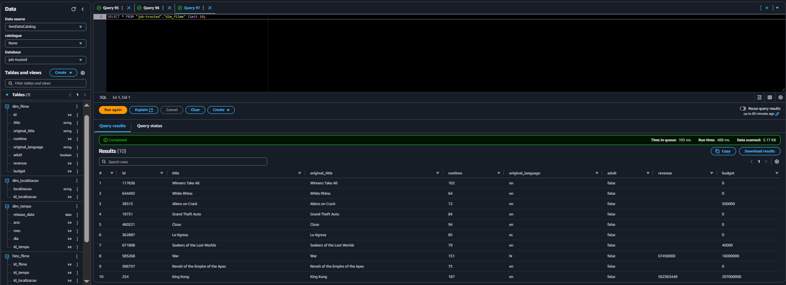
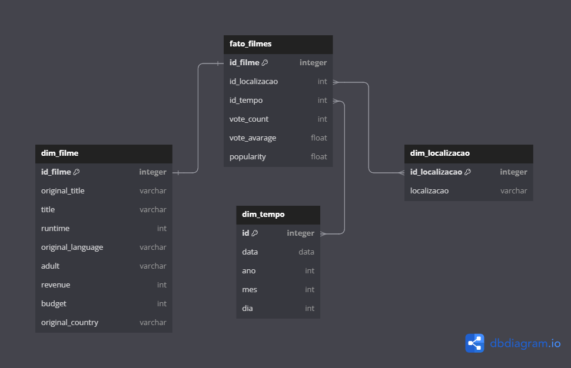

---
### Neste desafio foram feitos 2 scripts para tratar dois arquivos , um referente a uma camada pré-refined, onde foram salvos os arquivos em formato parquet após o cruzamento com o arquivo JSON para filtrar os filmes em comum; e outro script foi feito para fazer o dimensionamento a parte, salvando as dimensões em uma pasta a parte. Os processos são de certa forma semelhantes, e em virtude disso, serão explicados de forma paralela nas etapas.

#

## Etapa 1:

O propósito dos códigos abaixo é realizar uma série de tarefas para preparar o codigo para o estagio final. Os codigos estarão devidamente explicados através dos comentarios nos proprios codigos. Segue abaixo:

### Script dos arquivos da camada Pré-refined:

```python 
import sys
from datetime import datetime
from awsglue.transforms import *
from awsglue.utils import getResolvedOptions
from pyspark.context import SparkContext
from awsglue.context import GlueContext
from awsglue.job import Job
from pyspark.sql import functions as F
from awsglue.dynamicframe import DynamicFrame

# Inicializando contextos Glue e Spark
args = getResolvedOptions(sys.argv, ['JOB_NAME'])
sc = SparkContext()
glueContext = GlueContext(sc)
spark = glueContext.spark_session
job = Job(glueContext)
job.init(args['JOB_NAME'], args)

# Declarando caminhos de entrada
caminho_s3_entrada1 = "s3://data-lake-do-rafael-prado/Trusted/JSON/2024/12/13/"
caminho_s3_entrada2 = "s3://data-lake-do-rafael-prado/Trusted/CSV/2024/12/12/"

# Lendo dados da Trusted em DynamicFrame e convertendo em Dataframe
dados_json = glueContext.create_dynamic_frame.from_options(
    connection_type = "s3",
    connection_options = {"paths": [caminho_s3_entrada1]},
    format = "parquet"
).toDF()

# Lendo dados do CSV em DynamicFrame e convertendo em Dataframe
dados_csv = glueContext.create_dynamic_frame.from_options(
    connection_type = "s3",
    connection_options = {"paths": [caminho_s3_entrada2]},
    format = "parquet"
).toDF()

# Renomeando a coluna "generoArtista" para inglês
dados_csv = dados_csv.withColumnRenamed("generoArtista", "artist_genre")

# Realizando o cruzamento dos arquivos, mantendo os dados do JSON e incluindo algumas colunas do CSV
dados_juntos = dados_json.join(dados_csv, dados_json["title"] == dados_csv["tituloPincipal"], "inner") \
                         .select(dados_json["*"], dados_csv["artist_genre"])

# Agrupando colunas com a coluna "artist_genre" em forma de lista, pois havia um ID's repetidos para os mesmos filmes, caso houvessem Ator e Atriz.
dados_agrupados = dados_juntos.groupBy(
    "id", "title", "original_title", "release_date", "runtime",
    "vote_count", "vote_average", "revenue", "original_language",
    "genres", 'origin_country', 'adult', 'budget', 'popularity'
).agg(
    F.collect_set("artist_genre").alias("artist_genre")
)

# Convertendo 'artist_genre' de array para string para tornar a visualização mais flexível
dados_agrupados = dados_agrupados.withColumn("artist_genre", F.concat_ws(", ", F.col("artist_genre")))

# Convertendo df de volta para DynamicFrame
dynamic_frame_agrupado = DynamicFrame.fromDF(dados_agrupados, glueContext, "dynamic_frame_agrupado")

data_atual = datetime.now()
ano = data_atual.strftime("%Y")
mes = data_atual.strftime("%m")
dia = data_atual.strftime("%d")
caminho_s3_saida = f"s3://data-lake-do-rafael-prado/pre-refined/{ano}/{mes}/{dia}/"

# Salvando dados na pré-refined (staged)
glueContext.write_dynamic_frame.from_options(
    frame = dynamic_frame_agrupado,
    connection_type = "s3",
    connection_options = {"path": caminho_s3_saida},
    format = "parquet"
)

job.commit()
```

### Script das dimensões da camada Refined:

```python
import sys
from awsglue.transforms import *
from awsglue.utils import getResolvedOptions
from pyspark.context import SparkContext
from awsglue.context import GlueContext
from awsglue.job import Job
from awsglue.dynamicframe import DynamicFrame
from pyspark.sql.functions import explode, split, trim, col, row_number, year, month, dayofmonth, regexp_replace
from pyspark.sql.window import Window

# Inicializando o contexto Glue e Spark
args = getResolvedOptions(sys.argv, ['JOB_NAME'])
sc = SparkContext()
glueContext = GlueContext(sc)
spark = glueContext.spark_session
job = Job(glueContext)
job.init(args['JOB_NAME'], args)

# Caminhos de entrada e saída
input_path = "s3://data-lake-do-rafael-prado/pre-refined/2024/12/13/"
output_path = "s3://data-lake-do-rafael-prado/Refined/"

# Lendo o arquivo Parquet em um DynamicFrame
datasource0 = glueContext.create_dynamic_frame.from_options(
    format_options={"multiline": False},
    connection_type="s3",
    format="parquet",
    connection_options={"paths": [input_path], "recurse": True},
    transformation_ctx="datasource0"
)
 
# Conversão para DataFrame para manipulação
df = datasource0.toDF()

# Criando Dimensão Filme (Não foi preciso criar ID's para a Dim_Filmes, pois os filmes ja haviam ID proprio, que foram aproveitados.)
dim_filme = df.select('id', 'title', 'original_title', 'runtime', 'original_language', 'adult', 'revenue', 'budget')

# Criando Dimensão Tempo
dim_tempo = df.select('release_date').distinct()
dim_tempo = dim_tempo.withColumn("ano", year(col("release_date"))) \
    .withColumn("mes", month(col("release_date"))) \
    .withColumn("dia", dayofmonth(col("release_date")))
windowSpecTempo = Window.orderBy("release_date") #Usando windowSpec para criar ID's da Dim_Tempo
dim_tempo = dim_tempo.withColumn("id_tempo", row_number().over(windowSpecTempo))

# removendo colchetes da coluna origin_country para que ficasse melhor de visualizar.
df = df.withColumn("origin_country", trim(regexp_replace(col("origin_country"), "\\[|\\]", "")))

# Criando Dimensão Localização
dim_localizacao = df.select(explode(split(col("origin_country"), ",")).alias("localizacao")).distinct()
dim_localizacao = dim_localizacao.withColumn("localizacao", trim(col("localizacao")))
windowSpecLocalizacao = Window.orderBy("localizacao") #Usando windowSpec para criar ID's da Dim_Localizacao
dim_localizacao = dim_localizacao.withColumn("id_localizacao", row_number().over(windowSpecLocalizacao))
dim_localizacao = dim_localizacao.dropDuplicates(["localizacao"])
dim_localizacao = dim_localizacao.filter(col("localizacao") != "")

# Separando siglas da coluna localizacao para ter uma filtragem mais flexivel no AWS QuickSight.
df = df.withColumn("localizacao", explode(split(trim(regexp_replace(col("origin_country"), "\\[|\\]", "")), ",")))

# Criação da Tabela Fato Filme com ID's e alguns dados numéricos.
fato_filme = df.select('id', 'release_date', 'vote_count', 'vote_average', 'popularity', 'localizacao')
fato_filme = fato_filme \
    .join(dim_filme.select('id', col('id').alias('id_filme')), on='id') \
    .join(dim_tempo.select('release_date', 'id_tempo'), on='release_date', how='left') \
    .join(dim_localizacao.select('localizacao', 'id_localizacao'), on='localizacao', how='left')

# Conversão de DataFrame para DynamicFrame para salvar no Glue
dim_filme_dyf = DynamicFrame.fromDF(dim_filme, glueContext, "dim_filme_dyf")
dim_tempo_dyf = DynamicFrame.fromDF(dim_tempo, glueContext, "dim_tempo_dyf")
dim_localizacao_dyf = DynamicFrame.fromDF(dim_localizacao, glueContext, "dim_localizacao_dyf")
fato_filme_dyf = DynamicFrame.fromDF(fato_filme, glueContext, "fato_filme_dyf")

# Salvando as tabelas dimensionais e de fatos no S3
glueContext.write_dynamic_frame.from_options(
    dim_filme_dyf, 
    connection_type="s3", 
    connection_options={"path": f"{output_path}dim_filme/"}, 
    format="parquet"
)
glueContext.write_dynamic_frame.from_options(
    dim_tempo_dyf, 
    connection_type="s3", 
    connection_options={"path": f"{output_path}dim_tempo/"}, 
    format="parquet"
)
glueContext.write_dynamic_frame.from_options(
    dim_localizacao_dyf, 
    connection_type="s3", 
    connection_options={"path": f"{output_path}dim_localizacao/"}, 
    format="parquet"
)
glueContext.write_dynamic_frame.from_options(
    fato_filme_dyf, 
    connection_type="s3", 
    connection_options={"path": f"{output_path}fato_filme/"}, 
    format="parquet"
)

job.commit()

```

### Etapa 2:

- Na etapa 2 foi feita a ``execução dos jobs da Pré-Refined e da Refined``. Segue a baixo as devidas evidencias de execução corretas:

### Run Job camada Pré-Refined:



### Run Job camada Refined:



- Em seguida foi feita a confirmação de que as pastas da ``Pré-Refined `` e `` Refined`` foram devidamente criadas, estando a ``Pré-Refined`` com os Parquets do cruzamento dos arquivos, e a ``Refined`` com as dimensões presentes na pasta. Segue abaixo:

### Arquivos Pré-Refined:



### Dimensões Refined:



- Abaixo encontram-se Queries feitas no serviço AWS Athena para confirmar que os arquivos foram criados devidamente, após a criação e execução de seus respectivos crawlers.

### Visualização Pré-Refined:




### Visualização Dim_Filmes da camada Refined:



--- 

- Por fim, foi feito o modelo dimensional no site ``DbDiagram.io``, ja usado anteriormente na Sprint 2. Segue abaixo:



--- 
